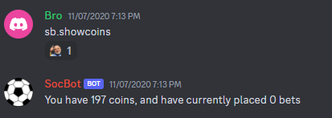
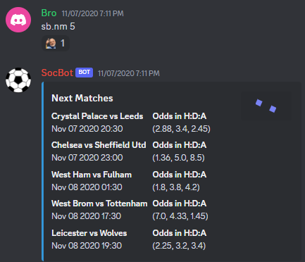
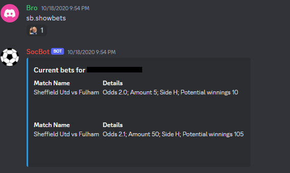

# SocBet
A soccer bot written in Python and SQL, it fetches live odds from Bet365 using its APIs. It gives all players 100 coins to start with, to bet freely on any matches they want to bet on, based on live odds. Winning the bet adds the coins, with the win amount to the player's coin stash.  

### Commands:

sb.showcoins - shows the current amount of coins for the user, with the number of active bets.  

sb.nm (default = 1) - shows the next set of matches, with their timings and odds. Has a default input for 1 match, but can be asked for upto 5 matches (as shown in the image).  

sb.showbets - shows active bets of a user, with potential winnings.  

